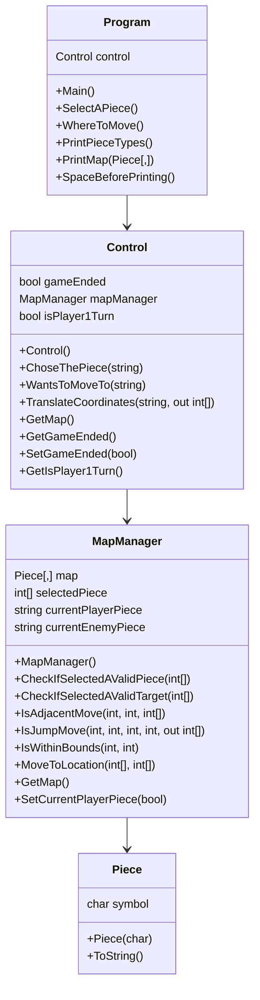

# Triang Triang

## Authors

- **Authors**:
  - Breno Pinto | 22308986
  - Martim Vicente | 22303341
- **Contribution Information**:
  - Martim: Implementation of the `MapManager` class and design of the game board.
  - Breno: Implementation of the `Control` & `Program` class and development of move validation logic.

- **Git Repository**:
  - [Link to the repository](https://github.com/ManancialGD/TriangTriang)

## Solution Architecture

### Solution Description
The project is a turn-based strategy game where two players move their pieces on a board with the objective of capturing all of the opponent's pieces. Each player selects their pieces and moves them to adjacent or specific locations on the board. 

- The `Program` class - as the View - manages the inputs and what will be shown on the console.
- The `Control` class - as the Controller - translates coordinates, manages the game's end state, and tracks the current player's turn.
- The `MapManager` class - as a member of the Models - calculates possible movements and moves pieces around.
- The `Piece` class - as a member of the Models - holds a character that represents a "Piece" in the game.

#### Note: We couldn't find any way to use polymorphism or interfaces in this project. We didn't find it helpful in any way.

### Class UML Diagram

## References
We talk about the game in discord and used the Live Share extention to code togheter.